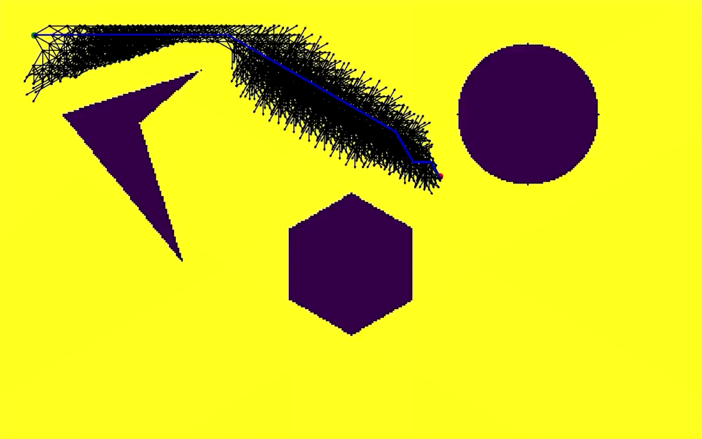

# A* Pathplanning | Mohammed Maaruf Vazifdar | UID: 117509717

## Introduction

**A*** is a modification of Dijkstra’s Algorithm that is optimized for a single destination. Dijkstra’s Algorithm can find paths to all locations. **A*** finds paths to goal location and prioritizes paths that seem to be leading closer to the goal.

## Software Requirements

1. Python 3
2. Numpy
3. Matplotlib
4. OpenCV 4

## Output Visualization

## Backtracked Path Example

## Steps to run code

1. `git clone https://github.com/maarufvazifdar/AStar_pathplanning`

2. `cd AStar_pathplanning`
3. `python3 AStar-pathplanning-maaruf-vazifdar.py`

4. Provide the following inputs to the program:

     **start x**, **start y**, **start theta**, **goal x**, **goal y**, **goal theta**, **step size**, **robot radius** and **robot-obstacle clearence**.

* (Default values for each input are provided, so just press enter if you want to use default values)

5. **A*** algorithm starts so please be patient as it can take a few minutes for the animation to finish.
